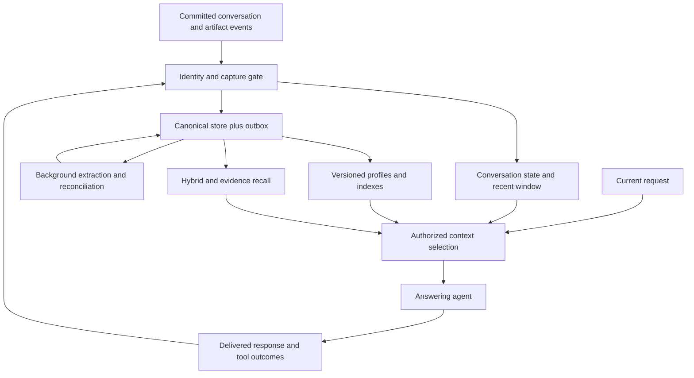

# ChatGideon conversational memory foundation

Design recommendation v0.2 · 21 September 2026

Status: implementation brief, not an implemented runtime or measured benchmark result. This document strengthens the supplied portable-memory v0.1 proposal. Retain its transactional, authority, temporal, privacy, and single-writer principles unless explicitly refined here. The priority is an excellent conversational assistant, followed by a portable framework proven through that assistant.

## 1. Decision

Build a small, evidence-backed memory runtime with a dedicated conversational state adapter. Optimize whether the next response uses the right past information, not the amount stored or the sophistication of the database. Preserve source context, decisions, exceptions, and reasons. Keep private memory attributable, correctable, revocable, and inspectable.

Use a TypeScript core, PostgreSQL as the first shared production authority, lexical and vector retrieval over accepted records and permitted evidence, and ChatGideon's authenticated owner Durable Object as the warm session projection after a fenced migration. Keep the API and background worker as two deployment roles, not a service per memory type. Add SQLite after the semantics and first integration pass conformance tests. Markdown is an inspection/export view. Jev is an optional classification adapter.

This recommendation favors the user's intended independent framework. A ChatGideon-only project could reasonably retain its Durable Object as canonical authority longer; PostgreSQL is not intrinsically more intelligent. The shared authority becomes useful when several applications need the same versioned state.

The product promise to test: a person can resume natural conversations without repeatedly explaining themselves, while the assistant respects corrections and knows when its memory is uncertain or irrelevant.

## 2. What the linked Instinct article establishes

The [linked X article](https://x.com/DhravyaShah/status/2101745550752428340) was read directly through the browser. Dhravya Shah describes an inferred combination of profiles, recaps, task state, linked records, and background maintenance. He explicitly lacks source-code access and reports weak implicit personalization and untested long-horizon behavior. His proposed Supermemory implementation is an integration demonstration, not proof of equivalent internals or end-to-end quality.

Adopt compact prepared context and deferred maintenance. Do not infer a daily job schedule from one delay, absence of hidden indexes from visible tools, or exponential cost growth without an algorithm and workload analysis. Larger repeated rescans may be costly without being exponential. Profile size and stale-profile tolerance are hypotheses to measure, not defaults to copy.

Supermemory documents static/dynamic profiles and graph-memory processing. Treat it as a serious baseline, not a vector-only straw man. [Profiles](https://supermemory.ai/docs/concepts/user-profiles), [graph memory](https://supermemory.ai/docs/concepts/graph-memory).

## 3. The conversational contract

The agent must handle the following distinctions:

| Situation | Required behavior |
|---|---|
| "The second one, but quieter" | Resolve the displayed/mentioned option within its turn; preserve the new constraint |
| "We ruled that out because it needs cloud access" | Retain rejection and reason within the decision, not a global dislike |
| "For this presentation, be formal" | Apply a task-local style override without rewriting the general profile |
| "Actually, I said Jev" | Repair the entity reference in the conversation and any affected candidate memories |
| "Let's return to yesterday's plan" | Resume the right open topic, with current state and unresolved choices |
| "How did the two plans differ?" | Recover the alternatives and tradeoff, not only the selected outcome |
| "Just for today" | Expire the exception rather than replacing a stable preference |
| "You never told me that" after interruption | Inspect actual delivery evidence; do not equate generated text with heard speech |
| A generic factual question | Answer without unnecessary personalization |
| An unsupported recollection | State uncertainty or ask one focused question; never manufacture shared history |

The assistant should usually apply ordinary preferences quietly. It should explain memory use when asked, when a conflict matters, or when a surprising inference would otherwise appear certain. Avoid repeating "I remember" as conversational decoration. Do not infer emotional diagnoses or durable personality traits from one frustrated turn.

## 4. One core, three coordinated state surfaces

### A. Conversation state

An explicit, bounded representation of the current conversational situation:

- Active topic and optional workstream ID; a bounded suspended-topic stack.
- Entity references and their candidate referents, including source turn and uncertainty.
- Shared artifacts: card IDs, document IDs, stable result IDs, visible order and display revision.
- Current choices, user selections, rejections and their stated reasons.
- Open questions, user requests, proposed next steps, and completion evidence.
- Local corrections, temporary constraints, and known unresolved ambiguities.
- A short recap plus a recent verbatim window. Preserve exact names, numbers, negation and commitments.

Use deterministic transport/artifact updates immediately. Model-derived interpretation can run with the answering model or asynchronously; do not add a mandatory separate model call before each response. Derived state always carries the source-turn watermark. If it lags, replay recent committed turns into the model's context rather than treating the recap as current.

Conversation state is initially session-scoped and expires under a documented retention policy. Meaningful open topics can be promoted to a persistent episode/workstream checkpoint. A topic is not automatically a workstream: casual conversation needs continuity without a project-management schema.

### B. Durable memory

Accepted facts, conditional preferences, decisions, episodes, and meaningful open loops. Preserve enough source detail to understand why a fact was accepted and where it applies. Keep permission to retain separate from permission to disclose in another application.

### C. Prepared context

Versioned read projections: a small stable profile, current topic/episode heads, an applicable-constraints index, retrieval indexes, and recent accepted changes. These are replaceable views. The canonical state is the event/accepted-edit store, not a free-form profile.



No generated response becomes evidence of a user preference. A tool outcome establishes an action outcome, not that the user heard about it. A user acknowledgment can establish agreement; the assistant saying "agreed" cannot establish the user's consent.

## 5. Canonical data model

Use common record/version storage with validated payload variants, rather than many unrelated memory engines. Minimum logical objects:

| Object | Required content |
|---|---|
| Principal, subject, scope, grant | Authenticated reader/writer, person or entity described, allowed application and actions |
| Event | Stable ID, idempotency key, conversation/turn, actor, source kind, committed phase, sequence, timestamps, consent, source span |
| Assertion version | Subject, kind, proposition/payload, scope, conditions, polarity, basis, status, times, evidence, dependencies, producer version |
| Episode/checkpoint | Topic, decisions, alternatives, reasons, open items, meaningful outcomes, source watermark |
| Projection | Input versions, covered sequence interval, policy/deletion epochs, generation version, freshness, expiry |
| Outbox job | Input versions, lease/fence, retries, budget, status, policy epochs |
| Deletion record | Authorized target IDs, suppression watermark, affected dependencies, logical/physical purge state |

Assertion kinds initially: fact, preference, constraint, decision. Episode/workstream payloads are separate variants in the same governed record system. Procedures come later.

Do not force arbitrary conversation into a fixed ontology. Use registered canonical slots for well-defined attributes (for example project database provider), with explicit cardinality. Use attributed propositions with typed conditions for the rest. An unresolved slot/entity mapping remains a candidate rather than a guessed global identity.

Keep these fields distinct:

- **Basis:** explicit user statement, user correction, verified tool result, inference, imported legacy record.
- **Status:** candidate, accepted, disputed, superseded, retracted, deleted.
- **Time:** source observation, server receipt, valid interval/precision, system interpretation interval.
- **Applicability:** project/topic/task, conditions, exceptions, expiry, environment.
- **Disclosure:** authorized scopes/clients and derivation permissions.
- **Confidence:** model output used for a particular decision, never a replacement for basis or authority.

"Accepted" means accepted as an attributed memory under policy. It does not mean an externally verified universal fact. Store "user reports X" where appropriate.

Example preference payload:

```json
{
  "kind": "preference",
  "subject_id": "user-1",
  "text": "Prefers quiet venues for work meetings",
  "conditions": {"activity": "work_meeting"},
  "exceptions": [],
  "basis": "explicit_user_statement",
  "evidence_event_ids": ["event-42"],
  "valid_time": {"from": null, "until": null, "precision": "unknown"},
  "status": "accepted"
}
```

The example omits envelope fields for readability; it is not the final wire schema. Explanations such as a rejection reason remain linked to their decision and original turn. Avoid expanding "quiet venues" into invented personal traits.

Raw evidence retention and accepted memory retention can differ. Before expiring evidence, either preserve a policy-permitted minimal supporting excerpt, or mark the memory's remaining provenance limitation explicitly. Do not claim full reconstruction after evidence is gone. Privacy deletion can require removing both evidence and derivatives.

## 6. Write path and learning policy

1. Authenticate and bind scope in trusted application code. Respect session learning/retention settings.
2. Accept only committed input. Preserve a stable turn ID; add explicit revisions when a later transcript correction changes it.
3. Validate payload bounds and redact disallowed secrets before persistence or remote inference.
4. Commit event and outbox job in one transaction. Return an event receipt.
5. Extract bounded candidates using the event plus necessary recent context. Require exact supporting spans and typed conditions. Do not give the extractor tool-execution permissions.
6. Retrieve existing candidates by subject/key, lexical match, and semantic similarity as needed.
7. Classify no-op, corroboration, new assertion, correction, real-world transition, scoped exception, dispute, or rejection.
8. Under a slot/record lock or expected revision, recheck authority, source versions, deletion/consent epochs, and cardinality. Commit the smallest valid change and projection invalidations.
9. Refresh only affected views. Mark their coverage and notify subscribed sessions.

Model calls stay outside database transactions. Jobs are at-least-once with idempotent effects and fencing; stale workers cannot publish old interpretations. Repeated statements copied from one event are not independent evidence.

Explicit remember/correct/forget gets priority. Deterministic structured edits need no classifier. A durable event receipt is not yet an accepted-fact receipt. The interface distinguishes captured, accepted, indexed, pending interpretation, and failed. The assistant says "remembered" only when the promised persistence state is actually committed.

Recent accepted corrections overlay old snapshots immediately within the authorized session. Ordinary fresh user statements are available in recent conversation before extraction, labeled as conversation evidence rather than silently upgraded profile facts. A correction that changes a source turn invalidates descendants of the old interpretation.

Implicit preference learning starts conservatively: several independent relevant observations, contextual agreement, and no unresolved counterevidence. Three sessions may be an initial experiment, not a correctness rule. A stable preference should not be learned from silence, one accepted answer, role-play, quotations, or the assistant's own suggestions. Avoid sensitive-trait inference by default.

Occupation is not a budget or taste preference. Do not translate "founder" into "wants expensive monitors." Prefer observed constraints, explicit priorities and rejection reasons. A missing budget can remain unknown or prompt a short clarification when it materially changes a recommendation.

### Maintenance

Use event-driven reconciliation and bounded periodic repair. Repair stale projections, unresolved candidate links, expired temporary constraints, duplicated evidence, and orphaned dependencies. Maintain a cursor and explicit per-user compute budget. Do not rescan every user's entire history nightly.

Re-extraction after a model upgrade runs in shadow mode and produces a diff. Accepted user edits and deletion records remain canonical. New model output cannot silently resurrect old beliefs. "Dreaming" must be specified as bounded jobs with measurable outputs, not a synonym for automatic improvement.

## 7. Retrieval that supports natural conversation

### Fast route

At session start, load authorized stable preferences, active episode heads, applicable constraints, compact indexes, and freshness metadata. For each committed turn:

1. Resolve the request against recent turns, current topic, and stable artifact IDs.
2. Apply newly committed corrections and local exceptions.
3. Select applicable constraints and preferences from the warm projection.
4. Retrieve exact keys, active decisions and local lexical candidates.
5. Compose a bounded pack, explicitly marking missing/stale/disputed evidence.

Do not use only the last utterance as the search query. "Same one as before" needs the resolved topic and referent. Do not concatenate an entire transcript into a query either. Use a structured retrieval request with topic/entity IDs, intended activity, time interpretation, and the smallest relevant recent span. Never invent a resolved ID when ambiguity remains.

### Deep route

For paraphrases, missing evidence, distant sessions, history, or multi-hop requests, search lexical and semantic branches in parallel; union their authorized candidates; fuse rankings; expand a bounded number of evidence/relationship links; optionally rerank; then compose. Search accepted assertions, episode summaries, and permitted source spans. Raw evidence fallback is essential when extraction missed a fact.

The answering agent can explicitly request deeper recall. Start with one bounded expansion and one evidence fetch per recall attempt; make larger searches an explicit mode with a deadline. Expose exhausted budget or partial coverage instead of manufacturing absence. A failed search means "not found in this search," not "you never said that."

### Applicable constraints

Build a small index of conditions such as activity, project, output format, equipment, and current goal. For a recommendation, retrieve constraints for the activity even when they share no words with the latest utterance. Combine explicit conditions with bounded model-assisted applicability judgments when necessary.

Keep retrieval aliases and inferred association hints separate from asserted facts. "Quiet venues" may be useful for a meeting query; it does not mean the user dislikes social events. Inferred applicability must be inspectable and reversible. A missing semantic candidate cannot be recovered by reranking only the candidates already retrieved.

Research motivation: [InMind](https://arxiv.org/abs/2607.24368) isolates failures where indirect queries do not surface known facts. [LoCoMo-Plus](https://github.com/xjtuleeyf/Locomo-Plus) tests applying earlier constraints across a semantic gap. These motivate an experiment, not proof that this proposed routing scheme solves the problem.

### Ranking and composition

Hard gates first: identity, disclosure, deletion, applicable time, and environment. Keep contradictory alternatives together where unresolved. Prefer current explicit scoped instructions over older defaults for the current task, without silently deleting those defaults. Source authority remains domain-specific.

Initial rank features: referent/key match, applicability, topic/goal relevance, evidence quality, appropriate recency, novelty relative to current context, and token cost. Use deterministic fusion and simple weights initially; tune on development data. Retrieval count is not usefulness. Never drop applicable hard constraints just because frequently retrieved facts score higher.

Compose separate sections for current conversation, applicable constraints, relevant memories, disputed interpretations, and evidence handles. The model sees attributed data with trusted usage instructions outside it. Never interpolate untrusted memory text as new privileged instructions. Labels and delimiters help presentation but are not a security boundary; tool/action policy remains enforced independently.

## 8. Voice, cards, and shared understanding

Track user speech hypotheses separately from committed speech. A read-only speculative lookup may be allowed under the same identity, but it produces no durable event, profile change, usage promotion, or external action. Bind its result to transcript hash, turn generation, scope and epochs; discard it when the final utterance differs.

Track assistant response states separately: generated, sent, playback-reported, displayed, acknowledged, interrupted. Use server-issued response and segment IDs. A client can report which server-generated segment it played; it cannot invent trusted assistant text. Playback reporting is evidence of playback, not proof of human attention or agreement. Without timing/alignment support, retain a conservative delivery bound or unknown state rather than claiming an exact heard word span.

User interruption cancels pending response delivery and invalidates turn-bound retrieval results. It does not undo an already completed tool action. That action's independently verified outcome remains distinct from spoken continuity.

For cards, retain artifact ID, revision, visible order at the referenced turn, selected item, and concise source-backed description. "The second one" resolves against that display snapshot, not a freshly sorted search result. Ordinary server-emitted cards and client visibility reports have separate provenance.

Future user-uploaded image memory should preserve an authorized asset reference and derived description with uncertainty and source metadata. Do not retain images or raw audio by default just because text memory is enabled. Support modality-specific retention. Never present an old room photo or stale map card as current reality.

Short verbal confirmations and optional memory receipts belong in the existing action ledger. Do not narrate internal classifications. During deeper recall, a brief honest acknowledgment is acceptable, but time to substantive answer must still be measured; filler audio must not game latency metrics.

## 9. Jev: bounded classification, removable dependency

[TypeSafe's documentation](https://docs.typesafe.ai/introduction) describes Choice, Score, and Noul outputs. Independent questions share input state but do not consume each other's answers. Stage dependent decisions in code.

Use Jev first in shadow background classification: memory candidacy, scoped preference versus temporary instruction, duplicate/update/exception relation, and applicability to a known task. Supply bounded evidence and candidate records. Do not ask Jev to decide tenancy, grants, irreversible deletion targets, or whether untrusted content authorizes an action.

The [launch article](https://typesafe.ai/blog/introducing-system-one-models-and-jev) frames guaranteed output types and vendor workflow evaluations. Those do not establish factual correctness on this memory workload. Calibrate on held-out labeled conversations, including negation, jokes, quotations, ASR mistakes, Urdu, Roman Urdu, English, and code switching. Report per-class precision/recall, selective risk, Brier score or other suitable probability calibration metric, and escalation rate. Distribution-derived confidence is not automatically the probability a stored assertion is true.

Compare rules, a conventional structured extractor, extractor plus Jev, and Jev-assisted gating plus extractor. Optimize total workflow cost and false-memory rate, not Jev's token price alone. Keep extraction and reconciliation model choices independently swappable. Failures fall back to explicit commands and ordinary conversation; they must not force guessed writes.

Do not put a remote Jev call on every warm voice turn. Consider serving-path use only when measured end-to-end benefit exceeds the added latency and failure exposure. No provider is required for structured remember/correct/forget operations.

## 10. Storage, cache coherence, and portability

Canonical PostgreSQL tables should provide transactional events/outbox, assertion versions, evidence/dependency edges, scoped indexes, jobs, grants and deletion suppression. Keep model-independent semantic contracts in the core. PostgreSQL native full-text search is not BM25; name actual scoring accurately. Add a pinned pgvector adapter early in the conversational-quality phase, with embedding version and authorized filtering. At small corpus sizes, compare exact search before choosing approximate indexing.

Only the canonical authority accepts committed durable changes after cutover. A Durable Object may relay a queued intent and maintain a recent local overlay, but a local receipt must not masquerade as central acceptance. Fence the legacy writer before enabling the new one. Never create an independently writable mirror of the old Supabase JSON array.

Cache keys and snapshots bind principal/client, scope, data watermark, policy/deletion epochs, and projection version. Corrections require data freshness; an unexpired privacy lease alone does not establish current facts. Auth/session revocation and memory snapshot revocation must agree; the current five-minute account cookie cache needs explicit reconciliation with any shorter claim.

Use push invalidation plus finite private-data leases. If choosing a five-second managed-cache revocation bound, use matching lease/revalidation behavior and test it; a 60-second disconnected lease cannot satisfy that promise. Renew while sessions are active, coalesce signals, and budget control-plane traffic. When the lease expires during an outage, omit private memory. Do not promise indefinite offline recall and immediate remote revocation simultaneously.

A forget operation first blocks canonical reuse and installs suppression; purge derivatives, source spans within the request, indexes, caches, queued jobs and permitted exports under separate reported deadlines. Recheck epochs before hydration and before dispatching a newly composed pack. In-flight model requests and content already delivered cannot be retroactively erased; cancel/suppress controllable stale output where possible and document the limit. Backup restore replays the deletion ledger before serving.

An independent framework needs a protocol and adapter conformance suite, not merely an MCP wrapper. Initial SDK surfaces: capture, remember, correct, forget, recall, resume, inspect, changes, export. Memory sessions bind identity in server code; the model cannot pass arbitrary tenant grants. A context pack returns evidence/version handles, consistency state, coverage, conflicts, token usage, and unavailable reasons.

Ship one server/worker application and a small inspector. Extract core and SDK boundaries now; publish separate packages only when another integration proves them. Add SQLite, MCP and the portfolio after ChatGideon works. A managed provider must advertise missing capabilities honestly; do not claim its deletion/provenance/temporal semantics match the core without verification.

## 11. Evaluation that can support competitive claims

### Diagnose three layers separately

1. Construction: were the right claims and conditions retained without invention?
2. Retrieval/composition: did relevant evidence and applicable constraints reach the model?
3. Conversation: did the answer use them correctly, naturally, and promptly?

Include an oracle-evidence diagnostic to distinguish retrieval failure from reader failure. Keep it clearly labeled, excluded from normal competitive results, and isolated from the system's ingestion and retrieval inputs.

### Baselines

No long-term memory; current ChatGideon with the receipt bug fixed; profile plus searchable session summaries; lexical retrieval; hybrid retrieval; v0.2 without applicability routing; full v0.2 without Jev; full v0.2 with Jev; and at least one current Supermemory or Hindsight configuration. Hindsight's retain/recall/reflect interface makes it a relevant baseline. [Hindsight](https://github.com/vectorize-io/hindsight).

Run two tracks: controlled reader/prompt/context/deadline comparisons, and best practical configurations with total latency/cost reported. Record write-time models, prompts, preprocessing, ingestion costs and time-to-ready too. Pin commits, dataset versions, provider versions where available, model IDs, seeds, and full configuration. Do not compare retrieval recall with end-to-end answer accuracy.

### Datasets

| Suite | Purpose and limit |
|---|---|
| [LongMemEval](https://github.com/xiaowu0162/LongMemEval) | Factual recall, temporal updates, multi-session reasoning and abstention; insufficient alone for natural personalization |
| [LoCoMo-Plus](https://github.com/xjtuleeyf/Locomo-Plus) | Earlier constraints with different later cues; preserve original protocol and report any adapted track separately |
| [PersonaMem](https://github.com/bowen-upenn/PersonaMem) and [PersonaMem-v2](https://arxiv.org/abs/2512.06688) | Evolving and implicit preferences; synthetic/multiple-choice performance needs open-response validation |
| [InMind](https://arxiv.org/abs/2607.24368) | Indirect applicability diagnostic; small targeted benchmark, not a full product score |
| [LongMemEval-V2](https://arxiv.org/abs/2605.12493) | Environment/workflow memory for later agentic features; do not confuse it with the original conversational benchmark |
| ChatGideon fixtures | Speech, artifacts, correction, scope, failures, multilingual conversation and over-personalization |
| Consented longitudinal pilot | Real repeat-explanation burden, correction rate, perceived continuity and unwanted familiarity |

Read complete dataset protocols and licenses before executing benchmark adapters; the paper abstracts/repositories inspected for this design are not a completed reproduction audit.

Split by user/trajectory, not random neighboring turns. Freeze held-out cases before tuning. Evaluate only history available at the query time. Separate acquisition tests from retrieval over pre-ingested corpora. Include irrelevant conversations, alternate names, topic switches, contradictory corrections, new users and negative personalization cases. Do not optimize on private test answers or promote benchmark answers into procedures.

### Metrics and gates

Primary product metrics: supported constraint adherence, correct conversation continuation, false personal claims per opportunity, repeated-correction rate, and unnecessary personalization rate. Report subgroups and sample counts. A pleasing style score must not compensate for false memories.

Infrastructure release gates: zero observed unauthorized disclosure, false successful-write receipts, speculative durable writes, deleted-data resurrection, and lost acknowledged writes in the defined conformance suite. Passing finite tests does not prove universal absence.

Initial performance hypotheses, measured on the real deployment:

| Measurement | Candidate target |
|---|---|
| Warm local selection/composition CPU | p95 under 10 ms |
| Added time to first substantive audio versus matched no-memory run | p95 under 50 ms for ordinary turns; tighten toward 15 ms only if data supports it |
| Deterministic explicit edit | p95 under 500 ms to canonical receipt |
| Ordinary background extraction | p95 under 30 s event-to-ready; visible pending state beyond the budget |
| Deep recall | Budget tiers of 300/800/2000 ms; report quality achieved at each deadline |
| Memory context | Test 384/768/1536/3072-token budgets, not one presumed optimum |

These are initial targets, not measured promises. Count model prefill, cold session load, regional network, extraction backlog, and added context. Measure p50/p95/p99, sample sizes and concurrent load. A local lookup benchmark excludes voice inference and cannot establish the full voice target.

Use paired trajectory-level bootstrap intervals for quality deltas, repeated model runs where nondeterministic, blinded judgment with human auditing, and deterministic checks for exact IDs/versions/forbidden disclosure. Small pilot samples are diagnostic. Predefine a material improvement target (for example five absolute percentage points on the chosen conversational composite) and non-inferiority limits for key categories before the confirmatory evaluation. Choose sample sizes using observed variance and clustering rather than assuming a fixed number proves superiority.

Run one ablation per major mechanism: source evidence, conditions/reasons, conversation state, hybrid recall, applicability routing, recent overlay, Jev. Keep added components only if they improve quality, reliability, cost, or operational simplicity under the relevant constraint. Publish failures and ingestion cost.

## 12. Migration and implementation order

Current source inspected at HEAD `30fb78be9e6bfd6faeefb472bdb7f2287e6c53e8`, with existing uncommitted visualization and agent-core changes. This was a source review, not a live deployment audit. Preserve unrelated changes.

| Phase | Concrete deliverable | Exit gate |
|---|---|---|
| 0. Baseline | Fix admission/receipt behavior; measure current memory; implement fixture runner and simple-summary baseline | A stored receipt means actual persistence; reproducible baseline report |
| 1. Durable correctness | One production backend, explicit commands, evidence, versions, outbox, deletion, inspector | Concurrency/idempotency/deletion/identity conformance passes |
| 2. Conversational state | Topic/referent/artifact state, decisions/reasons, open loops, recent overlay, source watermarks | Corrections, interruptions, topic switches and resumptions pass across sessions |
| 3. Natural recall | Structured query resolution, source fallback, hybrid retrieval, applicable constraints, adaptive context | Held-out conversational benefit over simple summary and current baseline |
| 4. Background learning | Conservative extraction, conditional preferences, bounded maintenance, Jev shadow trial | False-memory and escalation rates within preregistered limits; cost measured |
| 5. Production proof | Shadow comparison, internal cohort, consented pilot, fault/load/restore tests | Stable quality and latency; honest outage/deletion behavior; migration rollback rehearsed |
| 6. Independent framework | SQLite conformance, MCP, second app, versioned export, external docs | Same semantics across adapters; no ChatGideon identity or transport assumptions in core |
| 7. Advanced learning | Reviewed procedures, multimodal memory, learned routing only if justified | Held-out task benefit; compatibility and provenance preserved |

Phase 3 and 4 experiments can overlap once correctness and candidate isolation exist. Baseline provider evaluation starts before committing to expensive custom extraction/retrieval features. If a managed provider meets the same contracts at materially lower total cost, retain the core API and choose that operating mode rather than defending a custom implementation for its own sake.

Cutover: import legacy IDs/text as legacy evidence, compare counts and samples, fence old writes, apply the final delta, switch authority, then retire the writable array. Do not fabricate source spans or effective dates for legacy rows. Rollback preserves accepted corrections and deletion suppression; disabling new retrieval is safer than restoring a stale writable database.

### Repository touchpoints

- `src/lib/tools/memory.ts`: remove durable-retention coupling to 400-record selection; preserve exact destructive selectors; replace implicit truncation of semantic records with explicit validation.
- `src/lib/tools/registry.ts`: versioned commands and truthful receipts; read-only context selection; usage telemetry off the critical path.
- `src/lib/agent-core.ts`: replace plain fact injection with attributed context packs and continuity state; distinguish unavailable memory from an empty corpus internally while allowing graceful conversation.
- `src/server/memory-authority.ts` and `backend/worker/src/memory.ts`: one-writer migration fence, canonical commands, versioned projections and change watermarks.
- `backend/worker/src/accounts.ts`: preserve authenticated owner boundary; align session revocation with promised memory policy.
- Voice/card adapters: server-issued event IDs, transcript revisions, playback/display observations, and artifact-referent snapshots.

The source currently limits each fact to 240 characters and default context recall to four lexical matches against the latest user text. `contextMemories` mutates use counters during ordinary retrieval. These are concrete integration constraints, not measured statements about quality or latency. The new contract must also work without a remote classifier or embedding provider for explicit operations.

## 13. Long-term behavior and independent product strategy

Persist meaningful episodes and their reasons, not every transient utterance as a permanent personal attribute. Age temporary constraints by validity. Recheck volatile external facts when consequential use requires it. Keep stable preferences until corrected rather than making them decay simply because they are rarely retrieved.

Monitor memory growth, write amplification, duplicate rate, source coverage, unresolved conflicts, stale projection age, extraction backlog and per-user compute. Put budgets and backpressure on ingestion; explicit corrections/deletion outrank ordinary summarization. Cold users do not need continuously rebuilt profiles.

Model updates and embedding changes use versioned migrations, shadow indexes, reproducible comparison and rollback. Never silently mix vector dimensions or judge versions. Storage quotas must return truthful admission/retention behavior rather than silently losing acknowledged memories.

The defensible framework advantage is not the taxonomy or use of Jev. It is demonstrated conversational quality plus clear correction, evidence and deletion contracts, an inspector, reproducible evaluations, and adapters that actually preserve semantics. Procedural learning is a separate later experiment; external memory does not train the base model's weights.

The adjacent `acceptance-scenarios.json` contains seed specifications, not executable tests or benchmark results. Implement them in the harness, expand them with independently authored paraphrases and hidden trajectories, and preserve negative controls. Do not tune solely to this public list.

## 14. Evidence boundaries

Directly inspected: supplied v0.1 text; the linked X article through the browser; relevant current ChatGideon source; official TypeSafe, Supermemory and Hindsight material; original benchmark repositories and research abstracts cited above.

Not established: competitive rankings for this design, Jev accuracy/latency on ChatGideon, live production memory behavior, supplied-but-unattached DDL/contracts, independently reproduced vendor results, or years of operational durability. The architecture, routing policy, targets and rollout gates above are recommendations to validate.

No application code, provider configuration, user memory database, or deployment was changed in producing this brief.
